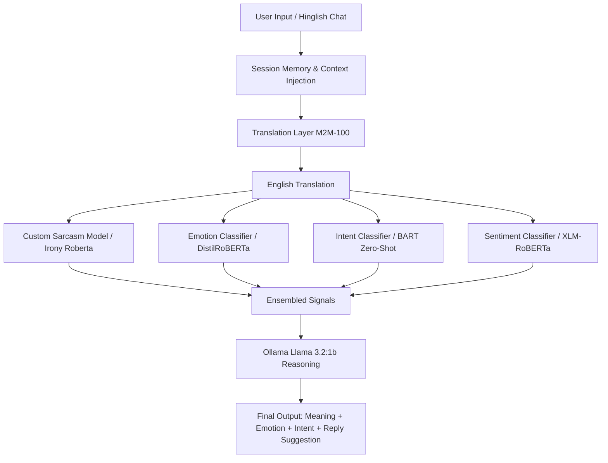

# 💬 ConvoSense AI — Decode the Vibes Mate

<div align="center">

[](#)
[](#)
[](#)
[](#)
[](#)

*Your digital wingman for parsing passive-aggressive messages, detecting sarcasm, and crafting reply suggestions using hybrid local AI pipelines.*

</div>

---

## 🧠 What’s this all about?

Ever been stuck thinking:
> *"Did she mean that… or did she mean that?"* 🤔

Yeah mate, we've all been there. 

**ConvoSense AI** is a local conversation intelligence system designed to help you decode:
* What someone *actually* meant underneath their text.
* Whether that "okay 👍" is chill... or a passive-aggressive red flag 🚩.
* If you are in trouble (spoiler: you probably are 😅).

Unlike standard AI classifiers that just output generic **"Positive / Negative"** sentiments, ConvoSense AI performs an ensembled analysis of **Sarcasm**, **Emotion**, and **Intent**, combining them with **Local LLM reasoning** to tell you exactly how to handle the chat.

---

## 🎯 High-Level Architecture & Workflow

Here is how the processing pipeline analyzes each message:



---

## 📁 Systematic Directory Structure

The project has been refactored into a systematic, clean Python package format:

```
VibeTranslator-main/
├── app.py                      # Main entry point (Streamlit App)
├── requirements.txt            # Dependency configuration
├── README.md                   # Beautiful, detailed documentation
├── .gitignore                  # Git ignore rules for cached models & environments
├── src/                        # Core codebase package
│   ├── __init__.py             # Marks directory as importable Python package
│   ├── models.py               # Preloads pipelines (Sentiment, Emotion, Sarcasm, Translation)
│   ├── llm.py                  # Connects to local Ollama Llama 3.2 instance & prompts
│   ├── memory.py               # Tracks rolling short-term chat context
│   └── utils.py                # NLP utility handlers & rule-based sarcasm heuristics
├── docs/                       # Project diagrams & documentation
│   ├── project_workflow.md
│   ├── project_workflow.txt
│   └── workflow_diagram.png
├── research/                   # Model prototyping, training notebooks & scripts
│   ├── model.ipynb
│   ├── sarcasm_training.ipynb
│   ├── build_rookie_nb.py
│   ├── build_sarcasm_nb.py
│   └── train_model_automated.py
├── scripts/                    # Validation & integration test scripts
│   └── verify_integration.py
└── dataset/                    # Dataset metadata / details
    └── Do drop a mail if you want the dataset.txt
```

---

## 🔥 Features & Models

| Feature | Model / Backend | Language Support | Description |
| :--- | :--- | :--- | :--- |
| **Sentiment Analysis** | `cardiffnlp/twitter-xlm-roberta-base-sentiment` | Multilingual | Classifies text sentiment as positive, neutral, or negative. |
| **Emotion Classification** | `j-hartmann/emotion-english-distilroberta-base` | English (Translated) | Identifies key emotions: anger, disgust, fear, joy, sadness, surprise, neutral. |
| **Zero-Shot Intent** | `facebook/bart-large-mnli` | English (Translated) | Categorizes intent (e.g., complaint, casual talk, attention seeking). |
| **Sarcasm/Irony Ensemble** | Custom DistilBERT OR `cardiffnlp/twitter-roberta-base-irony` | Multilingual + Heuristics | Ensembled model check paired with keyword heuristics (e.g., "acha thik hai", "rehne do"). |
| **Translation Layer** | `facebook/m2m100_418M` | Hinglish/Marathi/Hindi to English | Seamlessly translates colloquial Indian phrases into English before feeding downstream classifiers. |
| **Context Memory** | Custom sliding window history | All | Pre-appends recent history context for context-aware interpretation. |
| **Reasoning Engine** | Ollama (`llama3.2:1b`) | English + Hinglish | Local LLM that blends all classifier outputs into a funny, roasted, or supportive summary. |

---

## ⚙️ Setup & Installation

Follow these steps to run the application locally on your machine:

### 1. Prerequisite (Install Ollama)
Download and install [Ollama](https://ollama.com) on your machine.
Once installed, start the service and pull the lightweight Llama 3.2 model:
```bash
# Start Ollama (if not running in background)
ollama serve

# Pull the lightweight model (in a separate terminal)
ollama pull llama3.2:1b
```

### 2. Set Up Virtual Environment & Install Dependencies
Clone the repository and install the required Python packages in a virtual environment:
```bash
# Create a virtual environment
python -m venv venv

# Activate virtual environment
# On Windows:
venv\Scripts\activate
# On MacOS/Linux:
source venv/bin/activate

# Install dependencies
pip install -r requirements.txt
```

### 3. Verify the Core Pipelines
Run the integration script to ensure Hugging Face models are cached correctly and pipelines are linked:
```bash
python scripts/verify_integration.py
```

### 4. Run the Streamlit Interface
Launch the Streamlit web dashboard:
```bash
streamlit run app.py
```
Open **`http://localhost:8501`** in your browser to start chatting with your virtual wingman!

---

## 💬 Let's Try it!

Try pasting a classic passive-aggressive phrase in the chat:
```text
Acha thik hai tum busy ho toh rehne do
```
**ConvoSense AI** will translate it, identify the sarcasm, classify the emotion, and generate a response:
> **1. What they ACTUALLY mean:** They are annoyed that you are busy and are trying to make you feel guilty for not prioritizing them.
>
> **2. How they feel:** Sadness mixed with passive-aggressive anger.
>
> **3. What they WANT from you:** Attention, validation, and a quick apology.
>
> **4. Best reply:** *“Sorry na, was stuck with something. Free now, tell me what's up? ❤️”*

---

## 🔐 Local Privacy
* **Fully Local Execution:** No data leaves your machine. The Hugging Face models are cached locally, and LLM reasoning runs directly on your hardware via Ollama.
* **No Telemetry:** No analytics, tracker APIs, or external reporting.

---

## 🎯 Future Improvements
* **Integration Extensions:** Chrome extension for WhatsApp Web/Telegram Web.
* **Voice Support:** Voice inputs with real-time tone/audio inflection analysis.
* **Higher Accuracy:** Further training of the custom DistilBERT sarcasm model on localized sarcasm datasets.

---

## 🤝 Contributing
Have you ever misunderstood a message? Then you are already qualified to contribute! 😭 Feel free to submit pull requests or raise issues for bugs and feature suggestions.

## ⭐ Give it a star
If this project saves you from even **one argument**, give it a star! That’s a win mate.

## 📌 Roadmap Note
This project is a foundational block towards **DORA** (Direct Observational & Reasoning Agent) — a much larger, upcoming conversational intelligence and human-AI interaction system. Stay tuned!

---
*Made with a mixture of Transformer layers, Ollama reasoning, confusion, and emotional damage.*
